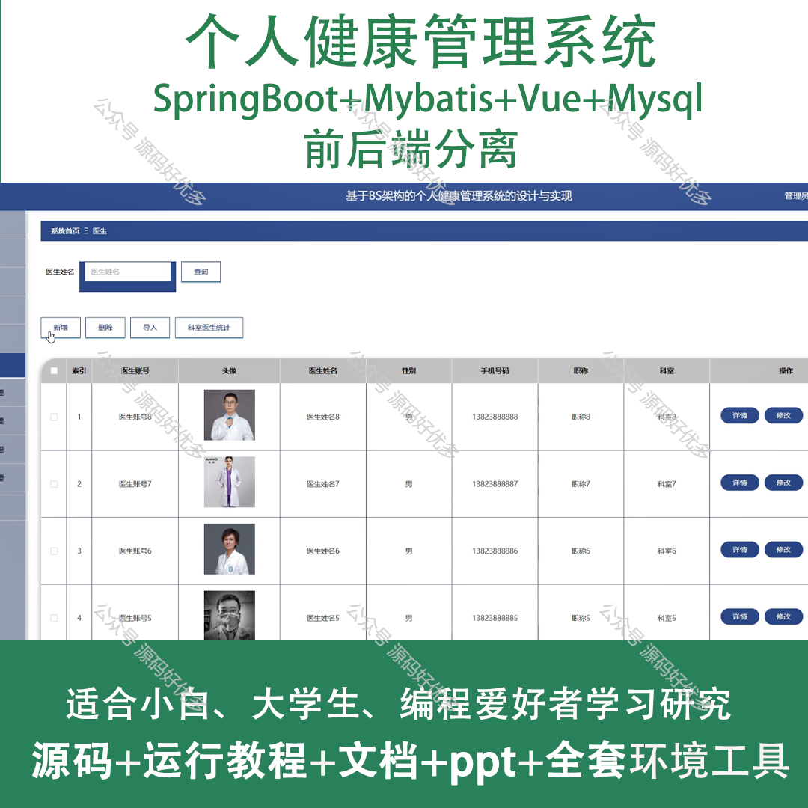
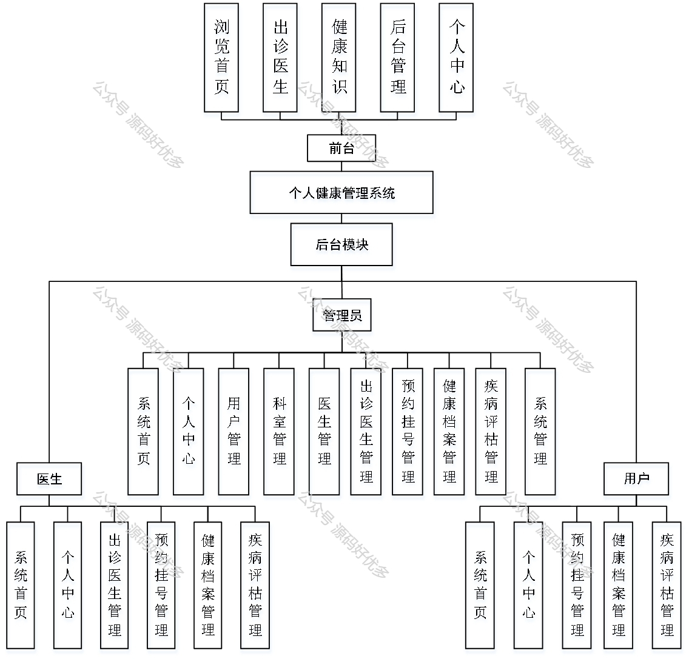
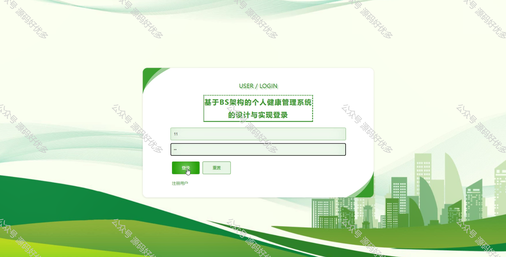
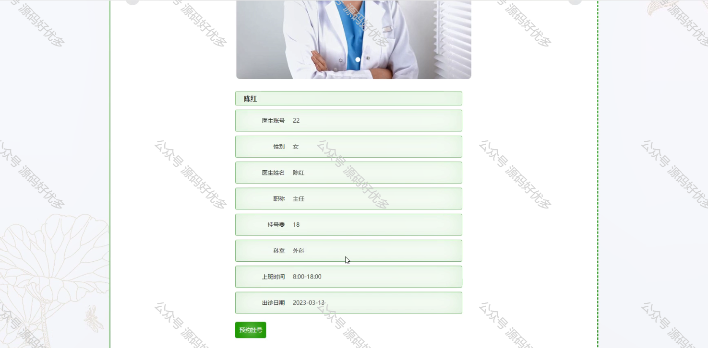
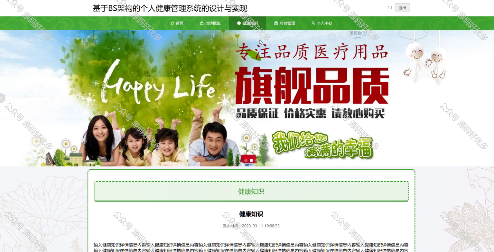
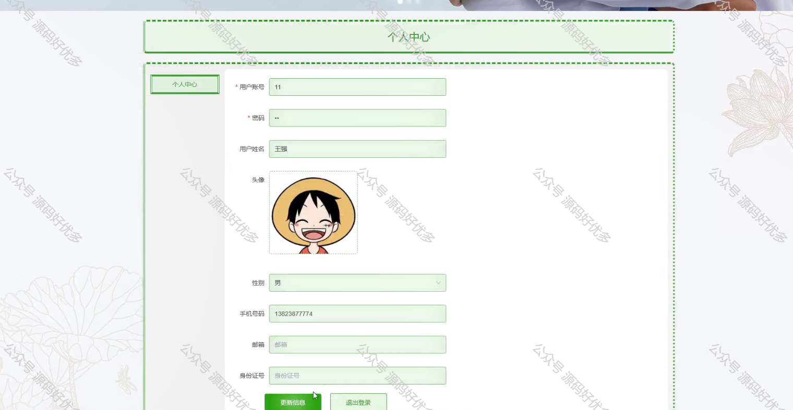
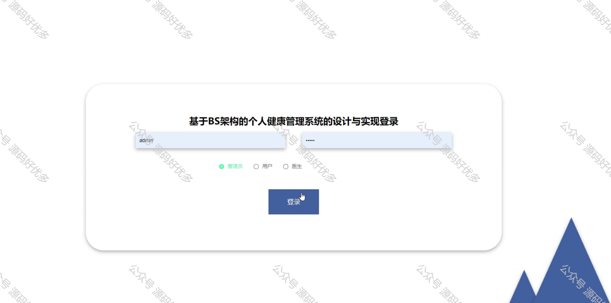
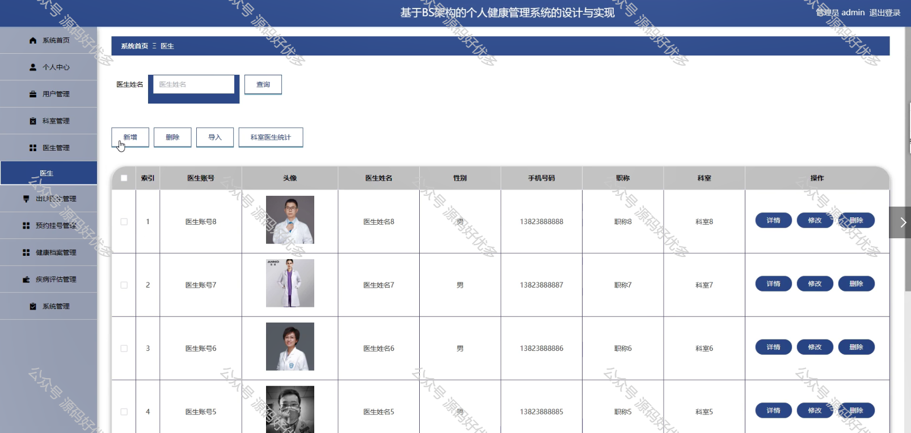
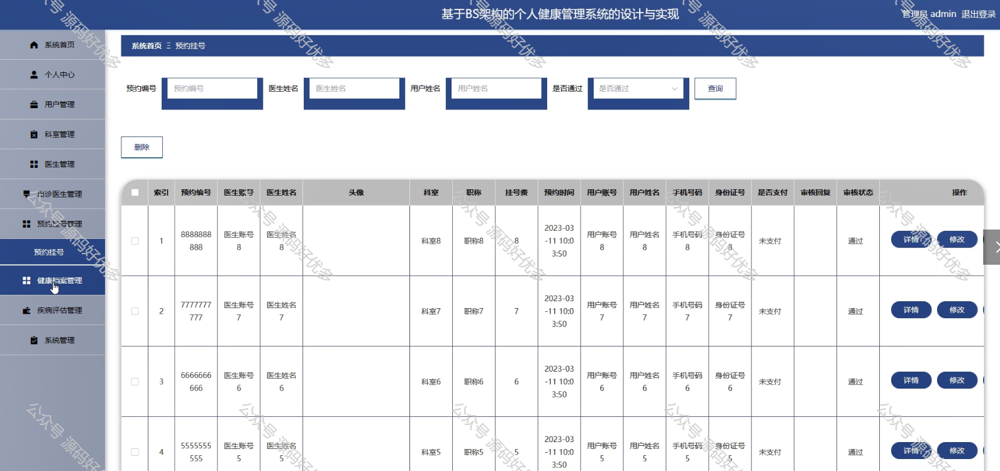
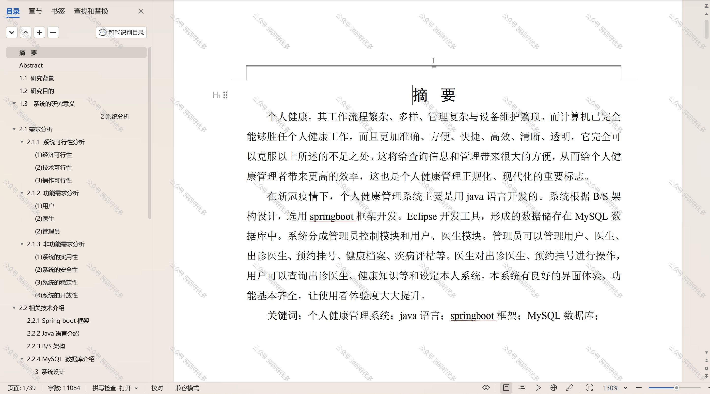

 
## 查看主页获取源码

### 一、作品包含

源码+数据库+设计文档万字+PPT+全套环境和工具资源+部署教程

### 二、项目技术

前端技术：Html、Css、Js、Vue、Element-ui

数据库：MySQL

后端技术：Java、Spring Boot、MyBatis

  

### 三、运行环境

开发工具：IDEA/eclipse

数据库：MySQL5.7

数据库管理工具：Navicat10以上版本

环境配置软件： JDK1.8+Maven3.6.3

前端Nodejs：14

### 四、项目介绍
项目编号：springbootA203

在当今社会，随着生活节奏的加快和健康意识的提升，个人健康管理系统应运而生，成为人们关注自身健康状况、预防疾病的重要工具，从而帮助用户建立科学的生活方式，实现健康自我管理，提升生活质量。

前台用户功能：浏览首页、出诊医生、健康知识、后台管理、个人中心。

后台分为管理员、用户、医生
管理员的功能：系统首页、个人中心、用户管理、科室管理、医生管理、出诊医生管理、预约挂号管理、健康档案管理、疾病评估管理、系统管理。
用户的功能：系统首页、个人中心、预约挂号管理、健康档案管理、疾病评估管理。
医生的功能：系统首页、个人中心、出诊医生管理、预约挂号管理、健康档案管理、疾病评估管理。

### 五、运行截图

  

